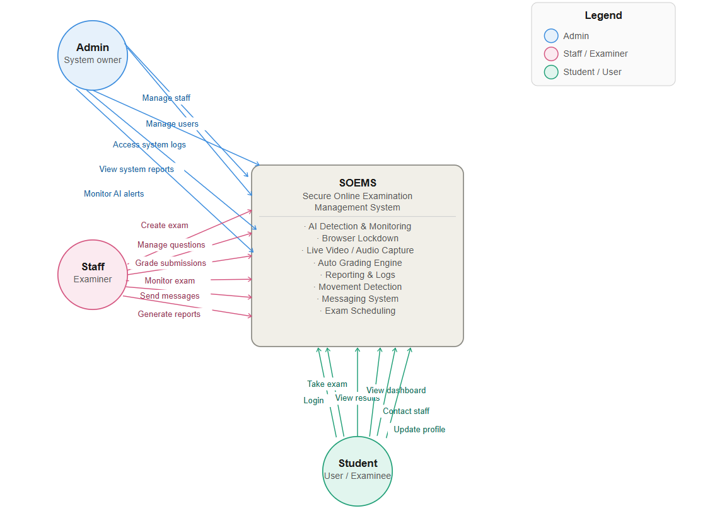
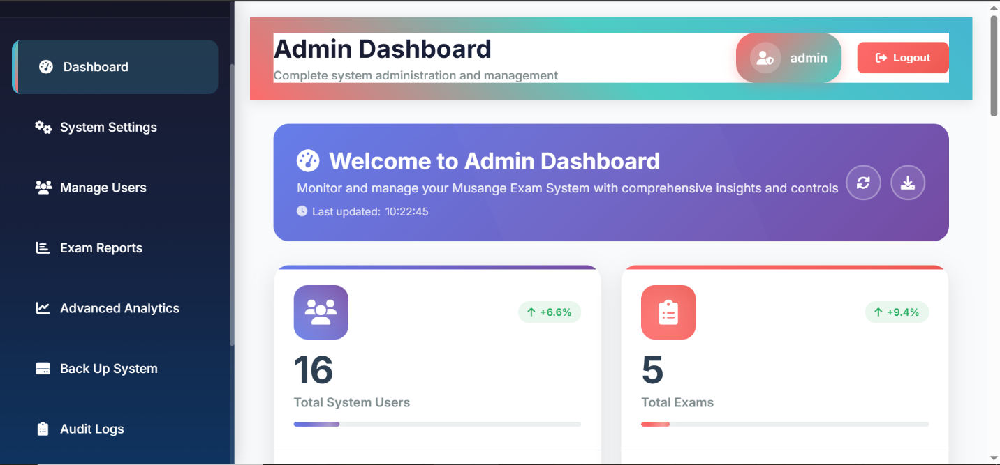

## SECURE ONLINE EXAMINATION MANAGEMENT SYSTEM

### Conceptual Framework

Secure online examination management system,
is a computer-based system that allows schools to create, manage and take exams online in a safe and controlled way. It makes exams easy ,fast and secure without using papers.

### Admin Dashboard

