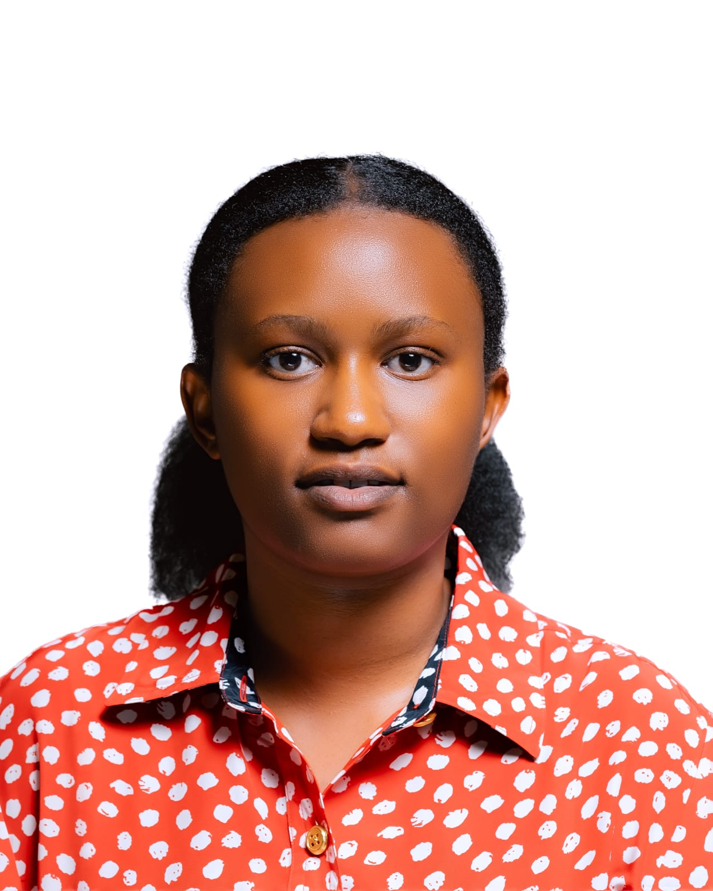

# Welcome to Rachel's Portfolio

{: width=200 align=right }

## About me
My name is **Rachel Nzayikorera**.

Iam a passionate and dedicated Software Developer with skills in designing, developing, and maintaining software applications. I have experience working with different programming languages, databases, and web technologies to create efficient and user-friendly systems

### My Work Experience

I have experience in software development, including designing, coding, testing, and maintaining applications and systems. I have worked with different programming languages, databases, and development tools to create reliable and user-friendly software solutions. I also have experience in troubleshooting technical issues, improving system performance, and collaborating with teams to complete projects successfully. 

#### Education
Secondary school 
Mathematics Economics Computer(MEC)

BACHELOR DEGREE IN (BBIT)

 Bachelor Business Information and Technology at university of kigali
KIGALI(UOK)

